# X5 python SDK

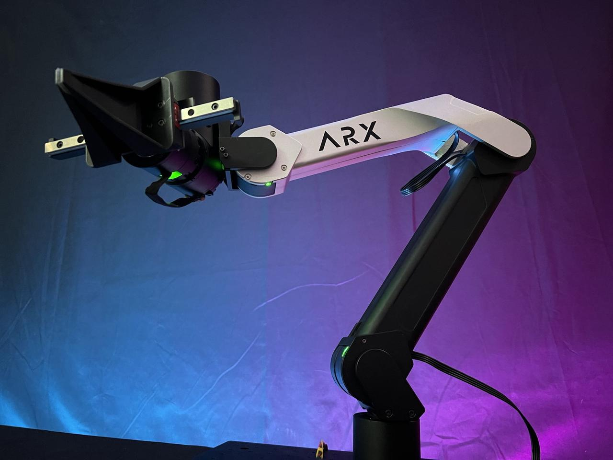

使用机械臂时，务必确保安装稳定，以基座为轴心一米半径内确保空旷，当心碰撞易碎物品及造成人员损伤。出现紧急情况请先关闭电源。

# 型号区分


| 型号           |                    | 示意图                                            | 区别         |
| -------------- | ------------------ | ------------------------------------------------- | ------------ |
| X5（2023）     | 标准单臂<br>       | 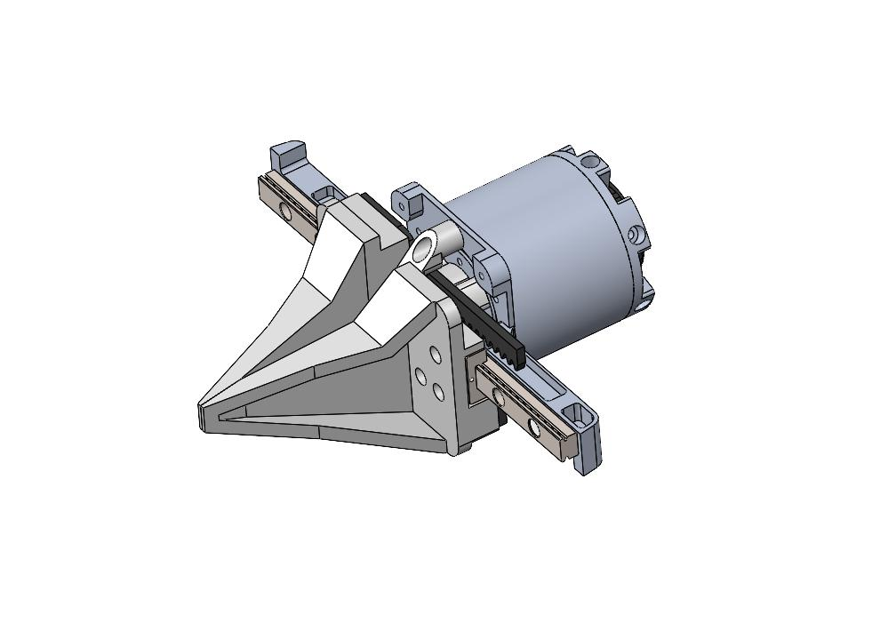 | 单轨二指夹爪 |
| X5（2025）<br> | AC one上机械臂<br> | 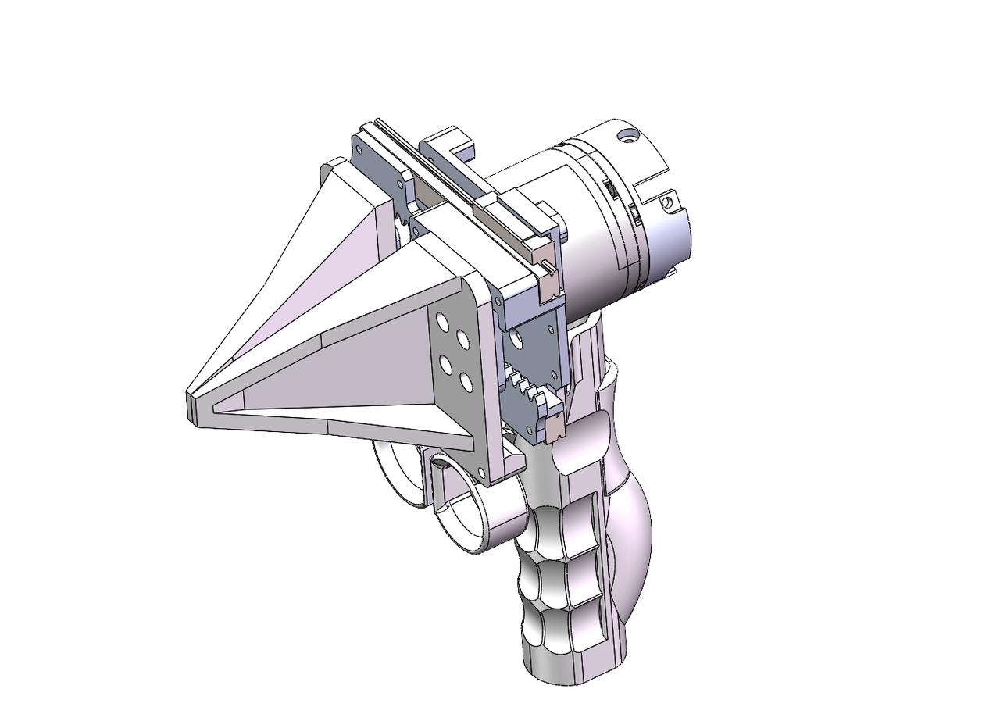 | 双轨二指夹爪 |


# 00硬件设备连接

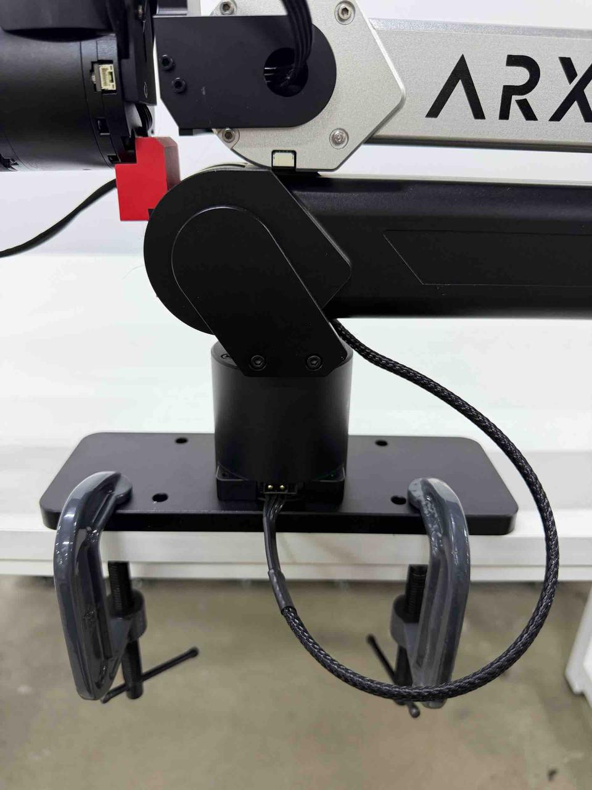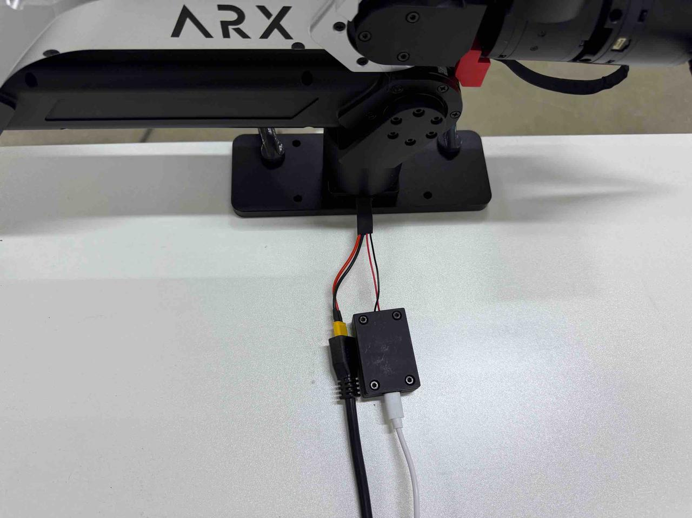

# 00环境配置

ARX\_X5/tools/

```Plain
./01_global_nopasswd_sudo.sh.x
./02install.x
./03_install_common_packages.sh.x 
```

# A配置CAN设备

设备如未更改，只需配置一次即可

多个设备设置时，需要逐个拔插。每次操作只有一台CAN设备在线。

ARX\_X5/ARX\_CAN/

```Plain
./search
```

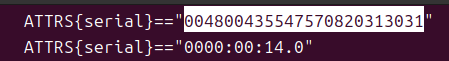

Copy number to arx\_can\.rulels,and save

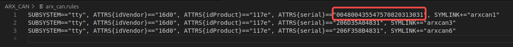

```Plain
./set
```

Start can

Cd arx\_can,start the number which you want\.

```Plain
./arx_can1
```

# B编译

ARX\_X5/py/arx\_x5\_python/

```Plain
./build.sh
```

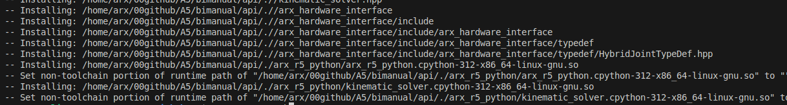

# C运行

ARX\_X5/py/arx\_x5\_python/

```Plain
source ./setup.sh
python3 test_single_arm.py
```

# SDK

## 0\>夹爪控制

set\_gripper\_pos\(\)


| 类型     | 夹爪范围   |
| -------- | ---------- |
| X5\-2023 | 0,5        |
| X5\-2025 | \-3\.14，0 |

## 1\>姿态控制

set\_ee\_pose\_xyzrpy\(xyzrpy\)

## 2\>关节位置控制（底层重力补偿）

set\_joint\_positions\(positions\)

## 3\>状态反馈

关节反馈（位置，速度，扭矩）\+姿态反馈

### 3\.1 关节位置反馈

get\_joint\_positions\(\)

### 3\.2 关节速度反馈

get\_joint\_velocities\(\)

### 3\.3 关节扭矩反馈

get\_joint\_currents\(\)

### 3\.4 末端位姿反馈

get\_ee\_pose\_xyzrpy\(\) 欧拉角形式

## 4\>重力补偿

gravity\_compensation\(\)

默认值仅含夹爪。加装摄像头等设备后，如遇到末端坠落，或者抬升。请参照\<6\>更改末端质量

若抬升，请调低数值

若下降，请调高数值

## 5\>根据关节位置，解算出姿态

forward\_kinematics\(\)

## 6\>更改末端质量

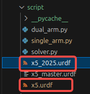

Change link6 mass

Remember to save

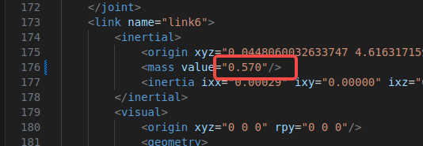

若抬升，请调低数值。

若下降，请调高数值。

## 7\>原点位置

### 关节轴向及零点位置

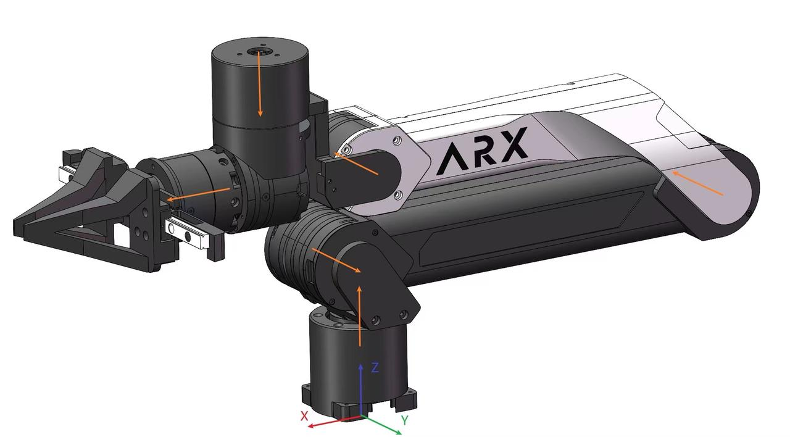

关节转向符合右手定理，大拇指的指向关节轴向，四指方向就是电机转动的正方向。

此位置为各关节零位。

### 关节范围

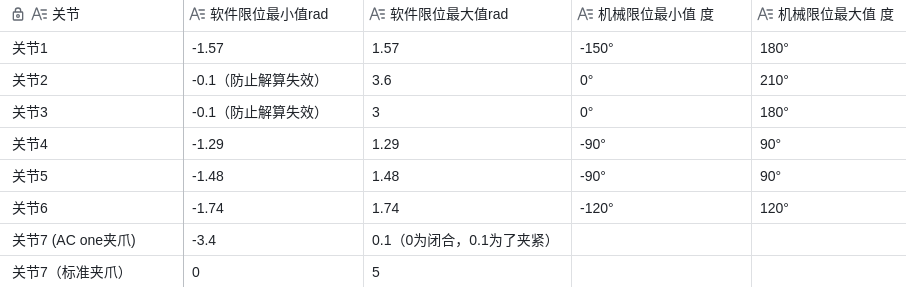

### 末端坐标系

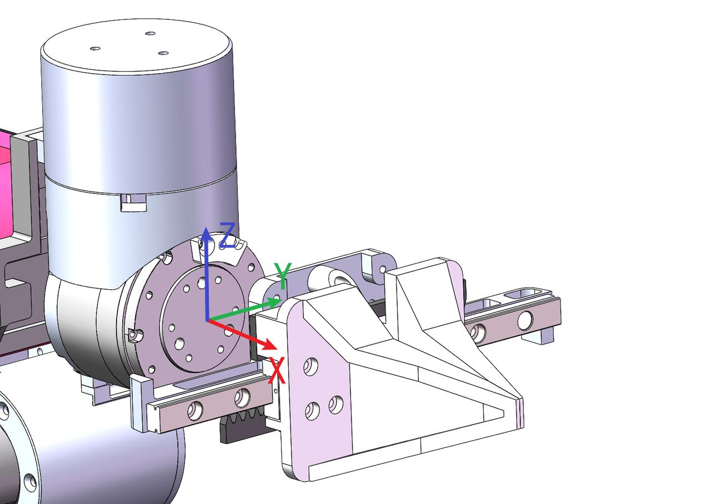

在初始位置，末端坐标系和参考坐标系重合，位置和姿态都是0，如上图所示。
